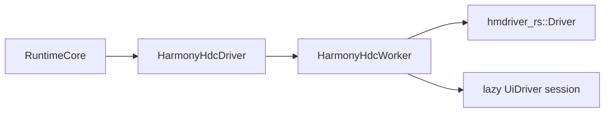
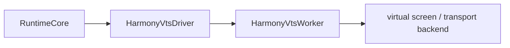

# Harmony HDC Driver Design

> 基于 `hmdriver_rs` 设计 Operator 的 `harmony.hdc` driver，并约束其集成方式、能力边界与迁移策略。

---

## 1. 背景与结论

当前 Operator 已经具备：

- typed `PlatformDriver` 抽象
- 命名 target + `platform / driver / driver_config`
- CLI / MCP / Agent 共用的 runtime / tool registry
- driver-scoped 的 `PermissionsReport`

Harmony 侧已有独立仓库 [`hmdriver_rs`](/Users/gokwok/code/work/hmdriver_rs)，其能力明显强于单纯的 HDC shell 封装，已经覆盖：

- 设备连接与 shell
- 应用枚举、启动、停止、当前前台应用
- 截图
- 窗口 / mission 查询
- UI 查询、组件操作、XPath
- 点击、右键、长按、双击、滑动、拖拽、文本输入、按键
- UI 事件监听（toast / recent event）

基于以上能力，结论是：

- **可以**基于 `hmdriver_rs` 实现一个第一阶段可用的 `harmony.hdc` driver
- 它足以支撑 Operator 当前最重要的一批能力：
  - screenshot-first `observe`
  - `list-apps`
  - `list-windows`
  - `click / type / press / hotkey / swipe / drag`
  - `launch / switch / quit / relaunch-app`
  - Agent 当前的视觉驱动 loop
- 它**不适合**第一阶段直接承诺完整桌面窗口管理语义，也不适合承诺完全等价于 macOS 的“指针 / 窗口系统”模型

因此，本设计将 Harmony 接入定义为：

- **平台**：`harmony`
- **第一阶段 driver**：`harmony.hdc`
- **后续可扩展 driver**：例如 `harmony.vts`
- **实现载体**：`crates/operator-platform-harmony`
- **上游能力来源**：迁移并保留历史的 `hmdriver_rs`

这里需要明确区分两层：

- `harmony` 是平台语义归属
- `harmony.hdc`、`harmony.vts` 等是 Harmony 平台内部的具体 driver 实现

后续即使新增 `harmony.vts`，也不应改 northbound target 模型；仍然是命名 target 解析到：

- `platform = "harmony"`
- `driver = "harmony.hdc"` 或 `driver = "harmony.vts"`

---

## 2. 设计目标

### 2.1 第一阶段目标

- 在 Operator 中落地 `harmony.hdc` driver
- 以 **Harmony PC** 作为第一阶段目标设备，而非 Harmony phone
- 使用 named target + `driver_config` 装配 Harmony 设备
- 默认提供 screenshot-first `observe`
- 提供足够支撑 CLI / MCP / Agent 的基础查询与动作
- 保留 `hmdriver_rs` 的历史提交，不采用手工复制文件的方式

### 2.2 非目标

- 第一阶段不追求 Harmony 与 macOS 动作面完全一致
- 第一阶段不要求完整窗口管理
- 第一阶段不把 Harmony 特有页面 / ability / mission 概念提升到 core
- 第一阶段不把 UI 树放进 agent 热路径
- 第一阶段不定义新的 northbound target 语法

---

## 3. 现有能力评估

### 3.1 `hmdriver_rs` 已具备的关键能力

按 [`docs/API.md`](/Users/gokwok/code/work/hmdriver_rs/docs/API.md) 和公开 API，当前 `hmdriver_rs` 可提供：

| 类别 | 现有能力 |
|---|---|
| 连接 | `Driver::builder(addr).connect()` |
| 设备信息 | `device_info()` / `display_size()` / `display_rotation()` |
| 截图 | `screenshot(path)` |
| 结构树 | `dump_hierarchy()` |
| 应用 | `list_apps()` / `start_app()` / `stop_app()` / `current_app()` |
| 窗口 | `list_windows()` / `get_window()` / `list_missions()` / `find_active_window()` |
| 输入 | `click()` / `right_click()` / `double_click()` / `long_click()` / `swipe()` / `drag()` / `input_text()` / `press_key()` / `press_keys()` |
| UI 查询 | `UiDriver` / `UiQuery` / `UiComponent` / `XPathNode` |
| UI 事件 | `watch_toast_once()` / `recent_ui_event()` |

### 3.2 与 Operator 当前能力面的对应关系

| Operator 能力 | `hmdriver_rs` 对应能力 | 第一阶段结论 |
|---|---|---|
| `observe` screenshot | `screenshot()` | 直接可做 |
| `observe` element tree | `dump_hierarchy()` | 可做，但仅进入冷路径 |
| `list-apps` | `list_apps()` | 直接可做 |
| `list-windows` | `list_windows()` / `get_window()` | 可做 |
| `get-focus` | `current_app()` + `find_active_window()` + `UiDriver` | 第一阶段不强承诺 |
| `click` | `click()` / `right_click()` / `double_click()` / `long_click()` / `UiComponent.click()` | 直接可做 |
| `type` | `input_text()` / `UiComponent.input_text()` | 直接可做 |
| `press` | `press_key()` | 直接可做 |
| `hotkey` | `press_keys()` | 直接可做 |
| `swipe` | `swipe()` / `SwipeExt` | 直接可做 |
| `drag` | `drag()` / `UiComponent.drag_to()` | 直接可做 |
| `launch-app` | `start_app()` | 直接可做 |
| `switch-app` | `start_app()` / `current_app()` | 可做，语义上视为 bring-to-foreground |
| `quit-app` | `stop_app()` | 直接可做 |
| `relaunch-app` | `stop_app()` + `start_app()` | 直接可做 |
| `move` | 当前库无稳定 cursor move API | 第一阶段不支持 |
| `scroll` | 当前库没有滚轮 / wheel API | 第一阶段不直接承诺 |
| `hide/unhide-app` | 无等价能力 | 第一阶段不支持 |
| `close/minimize/maximize-window` | 无稳定等价能力 | 第一阶段不支持 |
| `move/resize/set-window-bounds` | 无稳定等价能力 | 第一阶段不支持 |

---

## 4. 第一阶段能力边界

### 4.1 推荐的 CapabilitySet

`harmony.hdc` 第一阶段建议声明：

```rust
CapabilitySet::new([
    Capability::Capture,
    Capability::PointerInput,
    Capability::KeyboardInput,
    Capability::AppLifecycle,
    Capability::Permissions,
    Capability::DeviceInfo,
    Capability::Extension(CapabilityId {
        namespace: "harmony",
        name: "window-query",
    }),
])
```

说明：

- `Capture`：用于 screenshot-first observe
- `PointerInput`：用于点击、拖拽、滑动
- `KeyboardInput`：用于输入、按键、热键
- `AppLifecycle`：用于 app 启动/退出/切换
- `Permissions`：用于 driver-scoped 检查
- `DeviceInfo`：用于设备信息、显示大小、旋转
- Harmony 的窗口查询能力暂不等价于通用 `WindowManagement`，建议先用 `Extension(harmony.window-query)` 承载

### 4.2 对 Operator 现有模型的两处前置收口

为了让 Harmony driver 的能力声明准确，建议在接入前或接入同步完成以下收口：

1. **`observe` 的 capability 检查改为动态**
   - 当前 `observe` tool 静态要求 `Capture + InspectTree`
   - Harmony 第一阶段默认是 screenshot-only observe
   - 应改为：
     - `include_screenshot=true` 才要求 `Capture`
     - `include_elements=true` 才要求 `InspectTree`

2. **窗口查询与窗口管理能力解耦**
   - 当前 `list-windows` 绑定的是 `WindowManagement`
   - Harmony 第一阶段具备“查询窗口”，不具备“管理窗口”
   - 建议拆成：
     - `WindowQuery`
     - `WindowManagement`
   - 若不立即拆分，则 Harmony 第一阶段不应把 `list-windows` 暴露成通用查询工具

> 这两点不是 Harmony 独有 workaround，而是为了让 Operator 的 capability 粒度更真实。

---

## 5. northbound 契约

Harmony 接入后，对用户仍然保持统一命令面，不新增 Harmony 特有 target 语法。

命名 target 形式：

```toml
[runtime]
default_target = "harmony-pc"

[targets.harmony-pc]
platform = "harmony"
driver = "harmony.hdc"

[targets.harmony-pc.driver_config]
addr = "192.168.8.43:35319"
connect_key = "pc-01"
key_dir = "/Users/gokwok/.hdc"
timeout_ms = 60000
agent_path = "/absolute/path/to/uitest_agent_v1.1.0.so"
remote_agent_path = "/data/local/tmp/agent.so"
startup_delay_ms = 500
```

CLI / MCP / Agent 仍只通过：

```bash
operator --target harmony-pc ...
```

不会暴露：

- `local`
- `remote`
- `bridge`
- `device-id`
- `hdc://...`

这些细节全部属于 `driver_config` 和内部 driver 装配层。

未来若新增虚拟屏实现，也应保持同一 northbound 约束，只在 target 配置里切换 driver：

```toml
[targets.harmony-vm]
platform = "harmony"
driver = "harmony.vts"

[targets.harmony-vm.driver_config]
display = "virtual-1"
endpoint = "ws://127.0.0.1:9001"
```

---

## 6. crate 设计

### 6.1 目标结构

推荐结构：

```text
crates/
  operator-platform-harmony/
    Cargo.toml
    src/
      lib.rs
      config.rs
      factory.rs
      driver.rs
      worker.rs
      observe.rs
      query.rs
      action.rs
      normalize.rs
      permissions.rs
      errors.rs
    hdc_driver/
      base/
        src/
        docs/
        assets/
    vts_driver/
      base/
        # future
```

职责：

- `hdc_driver/base/`
  - 从 `hmdriver_rs` 迁移进来的基础实现，尽量保持原始结构与历史可追溯性
- `vts_driver/base/`
  - 未来基于虚拟屏或其他执行链的 Harmony 基础实现目录
  - 第一阶段只做架构预留，不提前实现
- `operator-platform-harmony/src/*`
  - Operator 适配层
  - 把 `hdc_driver/base`、未来的 `vts_driver/base` 等具体实现适配成 `PlatformDriver`
  - 做 capability、错误、类型和 northbound 语义映射

> **边界约束：** `operator-platform-harmony` 是平台 crate；`hdc_driver` / `vts_driver` 是平台内部的具体 driver family 目录，不单独提升为 workspace 顶层 crate。

### 6.2 为什么不直接把 `hmdriver_rs` 当最终 `PlatformDriver`

原因有三点：

1. `hmdriver_rs` 是同步 blocking API
2. `UiDriver` 内部使用 `Rc<RefCell<_>>`，不能直接作为共享的 `Send + Sync` driver 挂到 runtime
3. `Driver::ui()` 的初始化成本很高，会：
   - kill uitest daemon
   - push agent
   - start daemon
   - 建立 TCP forward

因此 `operator-platform-harmony` 必须是一个**显式适配层**，而不是简单 re-export。

---

## 7. 运行时结构

推荐采用单 worker 模型：



未来若接入 `harmony.vts`，建议并列采用同样的 worker 形态：



也就是说，worker / actor 形态应复用于 Harmony 平台下的多个具体 driver，而不是只绑定 HDC。

### 7.1 `HarmonyHdcDriver`

对外实现 `PlatformDriver`：

- `platform_id() -> "harmony"`
- `driver_id() -> "harmony.hdc"`
- `capabilities() -> CapabilitySet`
- `health_check()`
- `observe()`
- `query()`
- `act()`

### 7.2 `HarmonyHdcWorker`

内部长期持有：

- `Driver`
- 可选的 `UiDriver`

职责：

- 串行执行所有 HDC / UI 指令
- 懒初始化 `UiDriver`
- 复用已建立的 UI bridge，而不是每个操作重新启动
- 把同步调用包进 worker 线程，避免阻塞 async runtime

### 7.3 `UiDriver` 生命周期策略

建议：

- `Driver` 在 target 首次解析时建立
- `UiDriver` 在首次需要 UI 查询或组件定位时建立
- 后续重用同一个 `UiDriver`
- 若检测到 bridge 失效，再做重建

这比“每次 `ui()` 都建一次”稳定得多，也符合 Agent 高频 loop 的性能需求。

---

## 8. Observe 设计

### 8.1 第一阶段原则

- **默认 screenshot-only**
- **不把 UI 树放进 agent 热路径**
- `include_elements=true` 只走冷路径

### 8.2 Surface 支持策略

#### `Fullscreen`

- 直接使用 `Driver::screenshot()`

#### `Region`

- 先全屏截图
- 再在 host 侧做裁剪

#### `Frontmost`

- 获取：
  - `current_app()`
  - `find_active_window()` / `list_windows()`
- 若能得到活跃窗口 bounds，则对全屏截图做裁剪
- 若无法稳定得到窗口 bounds，则退化为全屏截图

#### `Window { id }`

- 优先通过 `get_window(window_id)` 取窗口几何
- 然后从全屏截图裁剪
- 如果 `window_id` 不存在或不可解析，返回 `ElementNotFound` / `Platform` 错误

### 8.3 元素树

第一阶段：

- `include_elements=false` 为默认热路径
- `include_elements=true` 时，可调用 `dump_hierarchy()`
- 但仅做冷路径归档，不进入 agent loop 默认上下文

第二阶段再做：

- `dump_hierarchy()` -> `Snapshot.elements`
- `SnapshotElement` locator
- 更稳定的 `get-focus`

---

## 9. Query 设计

### 9.1 `list-apps`

映射：

- `Driver::list_apps()`
- `Driver::current_app()`

归一化到：

- `bundle_id`
- `name`
- `pid = None`
- `is_running = true`

### 9.2 `list-windows`

映射：

- `Driver::list_windows()`
- 可选补充 `get_window()`

归一化到：

- `id = window_id`
- `title = name`
- `app_name = None` 或通过 `mission` 关联得到
- `bounds = rect`
- `is_focused = focused_window_id == id`
- `is_minimized = false`

> 注意：这是一种 Harmony PC 的窗口 / mission 查询语义，但仍不应误写成通用桌面窗口管理等价物。

### 9.3 `get-focus`

第一阶段不建议强承诺。

原因：

- `FocusInfo` 当前更接近“当前聚焦 UI 元素”
- `hmdriver_rs` 能较稳定拿到的是：
  - 当前 app
  - active window
  - 通过 `UiDriver` 查组件
- 但并没有一个直接、稳定的“focused component”统一接口

因此推荐：

- 第一阶段：不声明该能力
- 第二阶段：基于 `UiQuery.focused(true)` 或 hierarchy dump 进一步实现

### 9.4 `permissions-status`

`permissions` 应按 driver-scoped checks 上报，例如：

- `hdc.connect`
- `hdc.shell`
- `hdc.capture`
- `hdc.ui_bridge`

建议语义：

- `hdc.connect`
  - HDC 会话是否可建立
- `hdc.shell`
  - 是否能执行 shell 命令
- `hdc.capture`
  - 是否能成功截图
- `hdc.ui_bridge`
  - 是否能启动并连接 `UiDriver`

这些比“accessibility / screen_recording”更符合 Harmony 真实执行链。

---

## 10. Action 设计

### 10.1 第一阶段直接支持

| Action | 实现方式 |
|---|---|
| `click` | `ClickMode::Left` / `Right` / `Double` / `Long`；坐标点击，或先查询组件再点中心点 |
| `type` | 点击目标后 `input_text()` |
| `press` | `press_key()` |
| `hotkey` | `press_keys()` |
| `swipe` | `swipe()` |
| `drag` | `drag()` 或 `UiComponent::drag_to()` |
| `launch-app` | `start_app()` |
| `switch-app` | `start_app()` 视作 bring-to-foreground |
| `quit-app` | `stop_app()` |
| `relaunch-app` | `stop_app()` + `start_app()` |

### 10.2 第一阶段不直接支持

| Action | 原因 |
|---|---|
| `move` | 当前库没有独立 pointer move / hover API；对于 Harmony PC 这是一个真实缺口 |
| `hide-app` / `unhide-app` | 无稳定等价系统能力 |
| `close-window` / `minimize-window` / `maximize-window` | 无稳定等价窗口系统能力 |
| `move-window` / `resize-window` / `set-window-bounds` | 无稳定窗口几何控制能力 |

### 10.3 `scroll` 的处理

`hmdriver_rs` 当前没有鼠标滚轮 / wheel API，只有 `swipe` 一类触控滑动能力。

第一阶段有两种可选策略：

- **保守策略（推荐）**
  - 不实现 `scroll`
  - 在 driver 中返回明确 `Platform` 错误
  - 后续若 Operator 将 `PointerInput` 拆细，再精确声明能力

- **兼容策略**
  - 把 `scroll` 近似映射为竖向 / 横向 `swipe`
  - 语义上不是滚轮，而是“触控滚动”

考虑到第一阶段目标是 Harmony PC，而非手机，推荐文档和实现都先按**保守策略**处理，避免假装支持真实桌面滚轮语义。

### 10.4 locator 支持

第一阶段建议支持：

- `Coords`
- `Text`
- `Role`

映射方式：

- `Coords`：直接坐标动作
- `Text`：`UiDriver::text(...).first()`
- `Role`：映射到 `kind(...)`

第一阶段不默认支持：

- `SnapshotElement`

第二阶段再把 hierarchy dump 归一化后接入 `SnapshotElement`。

---

## 11. 错误与健康模型

### 11.1 错误映射

`hmdriver_rs::HdcError` 应统一映射到：

- `OperatorError::Platform`
- 必要时包上更清晰的 context，例如：
  - `failed to capture harmony screenshot`
  - `failed to initialize harmony ui bridge`
  - `failed to resolve harmony text locator`

不要把 `HdcError` 直接泄漏到 northbound JSON。

### 11.2 `health_check`

`health_check()` 建议返回：

- `healthy = true`
  - 当 `hdc.connect` 和 `hdc.shell` 都可用
- `message`
  - 当 `UiDriver` 不可用但基础 shell 可用时，指出限制
- `permissions`
  - 直接返回 driver-scoped checks

这样 CLI / MCP / Agent 可以统一理解 Harmony 的就绪状态。

---

## 12. 与 Agent 的关系

Harmony 第一阶段的目标是优先支撑当前 Operator agent loop。

因此必须满足：

- 自动 screenshot-only observe
- 当前 / 上一张图进入模型
- side-effect action 后可快速刷新截图
- 不依赖 UI 树即可完成主流程

这与 `hmdriver_rs` 的能力非常匹配：

- screenshot 强
- click / type / swipe / drag 强
- `UiDriver` 足以支撑文本 / kind 定位
- 不需要先做完整 `dump_hierarchy()` 归一化

因此 Harmony 第一阶段**先服务 agent loop**，再服务更完整的 CLI / MCP 结构化定位，是正确顺序。

---

## 13. 迁移与保留历史方案

### 13.1 目标

将整个 `hmdriver_rs` 仓库迁移进 `operator-platform-harmony`，同时：

- 保留原始提交历史
- 避免手工复制文件
- 后续仍可同步上游变更

### 13.2 推荐方案：保留历史地导入到 `hdc_driver/base`

推荐把 `hmdriver_rs` 的历史直接导入到：

- `crates/operator-platform-harmony/hdc_driver/base`

可以使用 `git subtree` 完成这一点：

```bash
git remote add hmdriver-local /Users/gokwok/code/work/hmdriver_rs
git fetch hmdriver-local
git subtree add --prefix=crates/operator-platform-harmony/hdc_driver/base hmdriver-local main
```

要求：

- **不要使用 `--squash`**
- 否则会丢失上游逐条提交历史

后续同步方式：

```bash
git fetch hmdriver-local
git subtree pull --prefix=crates/operator-platform-harmony/hdc_driver/base hmdriver-local main
```

这里的重点是：

- `git subtree` 只是**保留历史的迁移手段**
- 最终目录形态是 `operator-platform-harmony/hdc_driver/base/*`
- 它不是 `vendor/` 目录，也不表示“第三方 vendored dependency”

### 13.3 为什么不用手工复制

手工复制的缺点：

- 丢失提交历史
- 后续难以比对上游差异
- 迁移审计成本高

### 13.4 为什么不立即完全“打散”到 `src/`

第一阶段不建议把 `hmdriver_rs` 代码直接完全打散进 `operator-platform-harmony/src/`，原因：

- 历史难保留
- 上游同步困难
- 很难区分“基础 HDC 实现”和“Operator 适配层”

更合理的阶段顺序是：

1. 先把整个库带历史导入 `hdc_driver/base`
2. 外层写 `operator-platform-harmony` 适配层
3. 尽量把 Operator 特有逻辑放在 `src/`，而不是污染 `hdc_driver/base`
4. 只有在后续确认完全不再需要保留迁移边界时，再评估是否进一步内聚整理目录结构

### 13.5 Cargo 集成建议

`operator-platform-harmony` 不应再把 `hmdriver_rs` 当作独立 vendored crate 依赖。

推荐原则：

- `hdc_driver/base/*` 作为 crate 内部基础实现目录
- `src/*` 作为 Operator 适配层目录
- 不在文档或实现中延续 `vendor/` 语义
- 迁移完成后，以 `operator-platform-harmony` 作为唯一对外 crate 边界

---

## 14. 推荐实施顺序

1. 先把 `hmdriver_rs` 带历史导入 `hdc_driver/base`
2. 创建 `crates/operator-platform-harmony`
3. 添加 `HarmonyHdcDriverFactory` 与 `driver_config`
4. 先实现：
   - `health_check`
   - screenshot-only `observe`
   - `list-apps`
   - `permissions-status`
   - `capabilities`
5. 再实现：
   - `click / type / press / hotkey / swipe / drag`
   - `launch / switch / quit / relaunch-app`
6. 再补：
   - `list-windows`
   - 冷路径 `dump_hierarchy()`
   - `SnapshotElement` 第二阶段支持

---

## 15. 最终判断

基于 `hmdriver_rs`，Operator 的 `harmony.hdc` driver 是**可行且值得推进**的。

但推进方式必须是：

- 以 screenshot-first observe 为主
- 以 Agent 当前视觉闭环为优先目标
- 承认 Harmony 第一阶段不是桌面窗口管理 driver
- 通过保留历史的导入方式，把 `hmdriver_rs` 正式落入 `operator-platform-harmony/hdc_driver/base`

如果遵守上述边界，`harmony.hdc` 可以成为 Operator 第一条真正可用的非 macOS driver。
